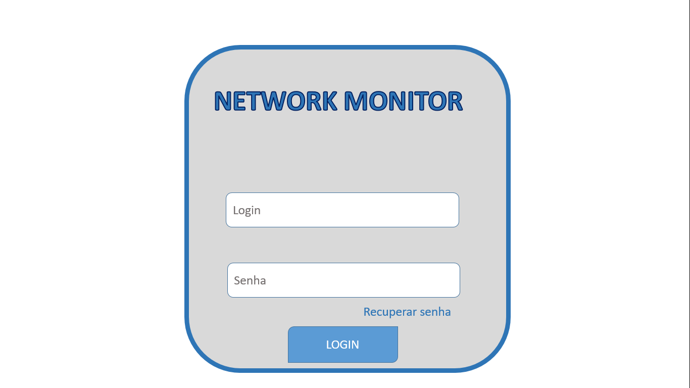
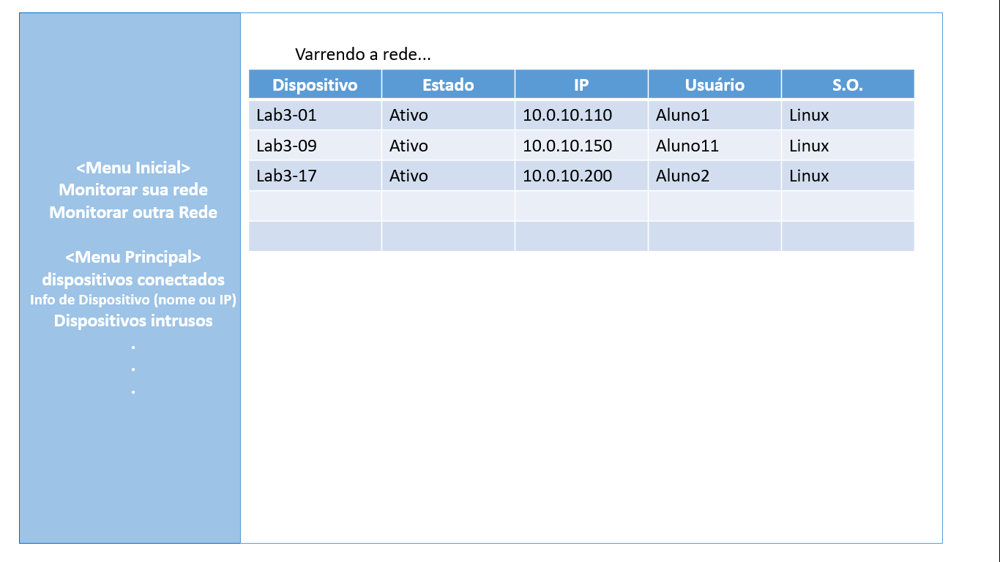

# Network Monitor

Aplicação que monitora dispositivos conectados à rede, com interface web, coletando informações como IP, nome, tipo, usuário logado (quando houver), entre outras.

## Inspiração

Ambientes corporativos e educacionais necessitam de monitoramento de dispositivos para a segurança do usuários e dos dispositivos.

## Protótipos

## Recursos da API
*

