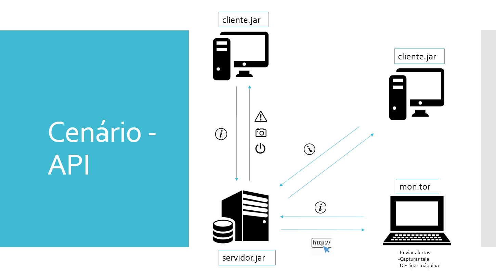

# Network Monitor


O Network Monitor é uma aplicação que monitora dispositivos conectados à rede, com interface web, coletando informações como IP, nome, tipo, usuário logado (quando houver), entre outras.


- [Instalação](#instalação)
- [API DOC](#api-doc)
  - [Informação](#informacao)
  - [Alertar](#alertar)
  - [Capturar Tela](#capturar)
  - [Desligar](#desligar)

## Instalação

Antes de realizar a instalação da aplicação é necessário tais programas para o funcionamento correto do sistema:

- Apache 2
- PHP 7.1
- MariaDB 10
- JVM 8

#### Servidor
servidor.jar

#### Cliente
cliente.jar

## Serviços

As informações do projeto são coletadas através de uma API. A seguir será detalhado os serviços disponiveis.

### Obter Informação

Esse serviço tem a finalidade de buscar informações detalhadas do host.

```
/api/info.php?host=:ip
```

Parametros

| Nome | Tipo | Descrição |
|-|-|-|
| :ip | String | Endereço de rede do host |

Exemplo

```
/api/info.php?host=192.168.0.1
```

Em caso de sucesso

```js
{
  "ip": "192.168.0.1",
  "mac": "AB-1F-74-40-9A-00",
  "nome": "lab03-07",
  "usuario": "aluno",
  "so": "Windows",
  "version": "10",
  "set": "1"
}
```

Em caso de erro

```js
{
  "ip": "192.168.0.1",
  "mac": "-",
  "nome": "-",
  "usuario": "-",
  "so": "-",
  "version": "-",
  "set": "2"
}
```

Este serviço foi extraido do commando: 

```
$ java -jar servidor.jar 1 3 :ip
```

Para testar a validade deste serviço basta verificar se a máquina `:ip` possui o dados gerados.

### Geração de Alertar

Esse serviço tem a finalidade de enviar mensagens de alerta para o host.

```
/api/alertar.php?host=:ip
```

Parametros

| Nome | Tipo | Descrição |
|-|-|-|
| :ip | String | Endereço de rede do host |


Exemplo

```
/api/alertar.php?host=192.168.0.1
```

Em caso de sucesso

```js
{
  "status": "alertado"
}
```

Em caso de erro

```js
{
  "status": "falha no alerta"
}
```

Este serviço foi extraido do commando:

```
$ java -jar servidor.jar 5 1 :ip
```

Para testar a validade deste serviço basta verificar se a máquina `:ip` exibiu uma mensagem de alerta.

### Capturar Tela

Esse serviço tem a finalidade de capturar a tela do host no momento em que é executada.

```
/api/tela.php?host=:ip
```

Parametros


| Nome | Tipo | Descrição |
|-|-|-|
| :ip | String | Endereço de rede do host |


Exemplo


```
/api/tela.php?host=192.168.0.1
```
Em caso de sucesso

```js
{
  "status": "192.168.0.1.png"
}
```

Em caso de erro

```js
{
  "status": "falha ao capturar a tela"
}
```

Este serviço foi extraido do commando:

```
$ java -jar servidor.jar 3 1 :ip"
```

Para validar verifique se foi gerado a imagem `ip.png` no servidor.

### Desligar

Esse serviço tem a finalidade de desligar o computador indicado pelo endereço ip.


```
/api/desligar.php?host=:ip
```

##### Parametros
---
| Nome | Tipo | Descrição |
|-|-|-|
| :ip | String | Endereço de rede do host |


##### Exemplo
---

```
/api/desligar.php?host=192.168.0.1
```

Em caso de sucesso

```js
{
  "status": "desligamento enviado"
}
```

Em caso de erro

```js
{
  "status": "falha ao enviar o desligamento"
}
```